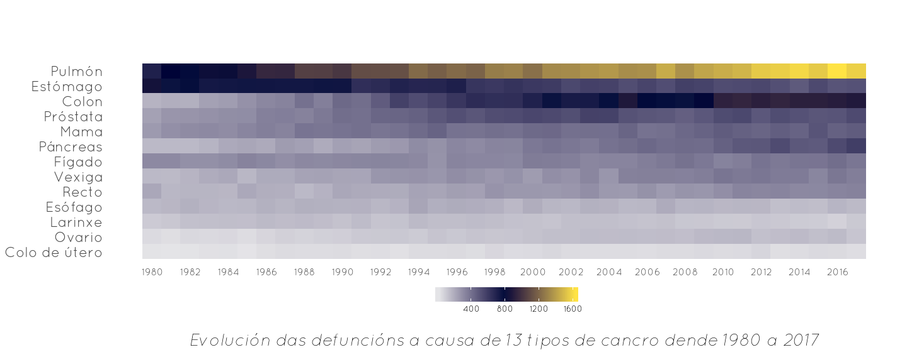
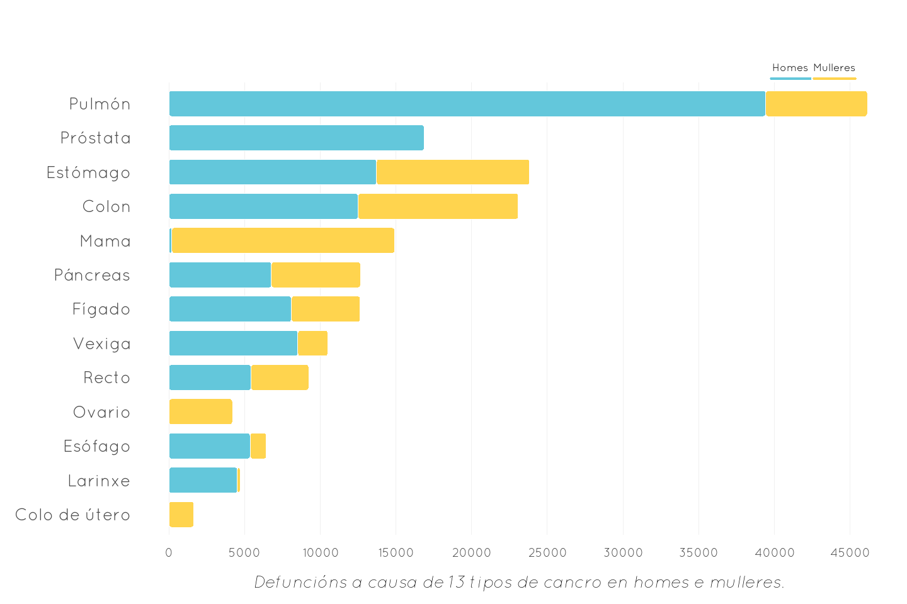
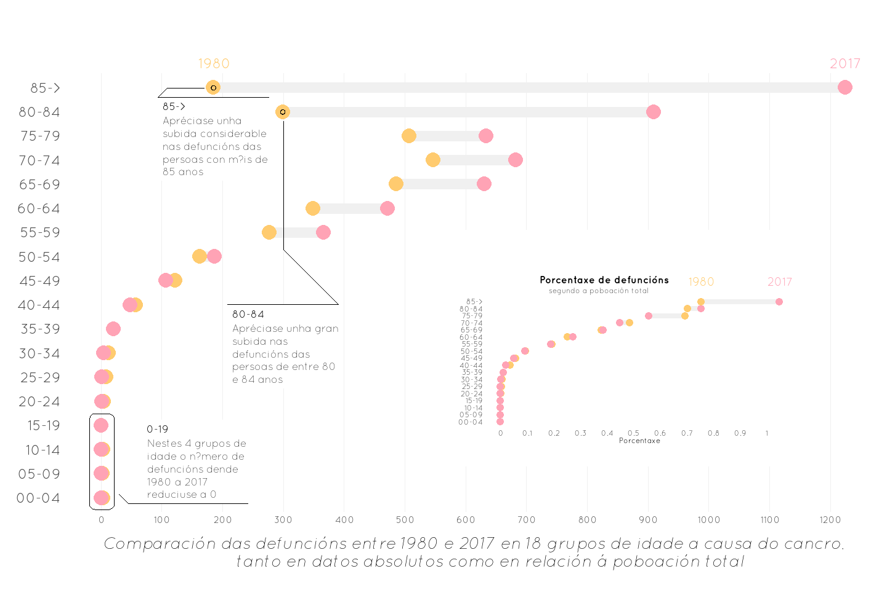
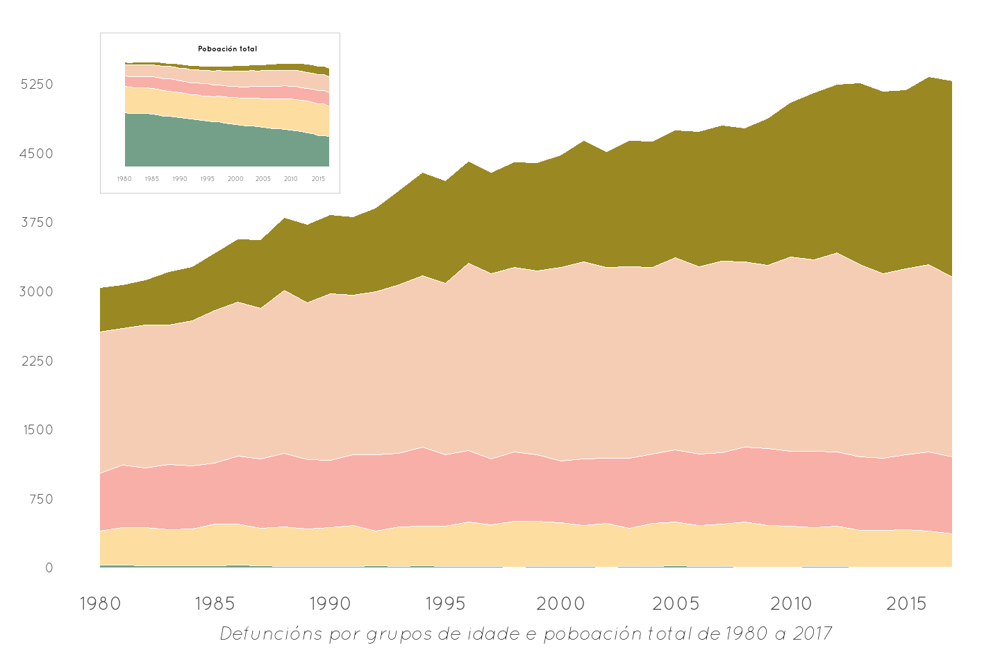
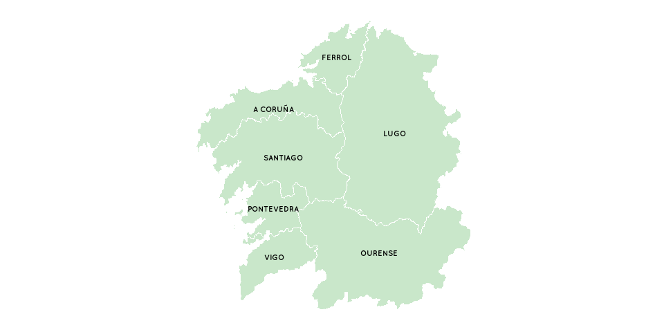
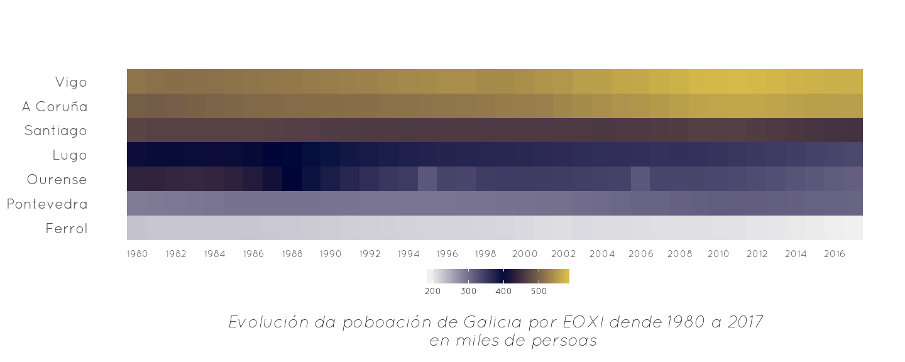
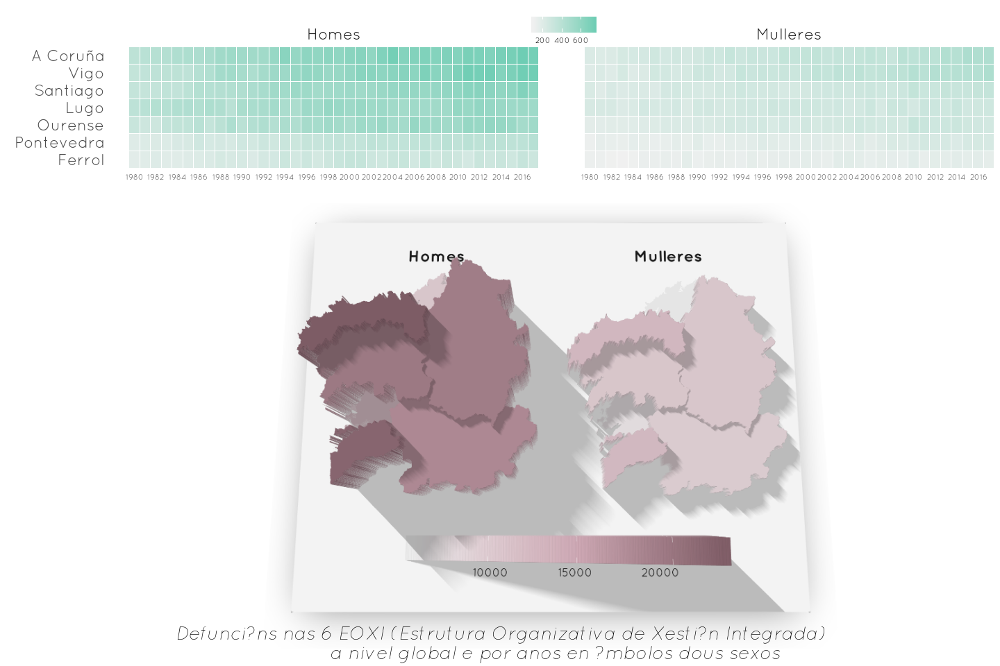
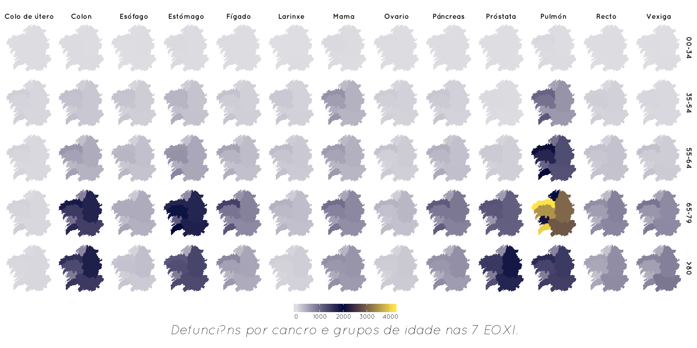

Neste pequeno artigo fálase sobre divulgación, esa parte tan importante dentro da ciencia para achegar os problemas e as súas solucións (se as houbera) á meirande parte da xente. En numerosas ocasións a investigación non é quen de transmitir o feito, ben sexa pola dificultade, ben sexa pola desgana ou a incapcidade de facelo, mais intentar simplificar un asunto científico e facelo entendible debería estar na base desta.

Nesta ocasión falamos sobre a amplitude de cancros que teñen influencia nas defuncións de persoas en Galicia, partindo dun conxunto de datos que comeza en 1980 e remata no 2017 e que foi aportado polo [SERGAS](https://www.sergas.es/Portada?idioma=ga).

Temos uns datos e imos ver que conteñen. Primeiro, mediante unha [contextualización da situación](#primeiro)  e despois introducindo a compoñente territorial nunha [xeografía do cancro](#segundo).


## **Contextualización da situación** {#primeiro}
#### Unha visión global

<br>

Dende o ano **1980** ata o ano **2017** houbo <a id="div1">`r simca_def`</a> defuncións, das cales `r simca_def_homes` foron de homes e `r simca_def_mulleres` mulleres. Tamén é importante coñecer a evolución do número de defuncións en cada un dos cancros e con respecto aos demais. Así, na seguinte imaxe vemos como o cancro de <a id="div1"> pulmón </a> é o que máis aumenta nestes *37* anos.

<br>




Para esta parte hai que ter en conta que os datos conteñen variables segmentadoras tales como [sexo](#sexo) e [idade](#idade), dividida en **18** grupos. Así que profundicemos nelas!

<br>

## Sexo e cancro {.tabset #sexo}
#### homes e mulleres

<br>

Poida ser que o sexo sexa un factor diferenciador na influencia da mortalidade por cancro en Galicia. Quen non pensa que hai certos cancros que se dan máis nun sexo ca noutro (agás aqueles que son propios unisexuais)? 

Imos ver!


### Táboa


*Defuncións a causa de 13 tipos de cancro en homes e mulleres*

```{r echo=F}
simca_cancros_taboa
```


### Gráfico




## **

Tanto a táboa como o gráfico dinnos que o cancro que máis defuncións acumula é o cancro de <a id="div1"> pulmón </a>, que ten afección en homes, sobre todo. Outros cancros como **esófago**, **larinxe** e **vexiga** tamén semellan darse con maior frecuencia en homes. Pola contra, o cancro de **mama** é case exclusivo das mulleres.

<br>
<br>

## Idade e cancro {.tabset #idade}
#### 18 grupos de idade

Quen non relaciona a idade co cancro? Para comprobar isto non necesitariamos estes datos, é algo aceptado pola comunidade científica que o cancro ten unha [relación positiva](https://www.cancer.gov/about-cancer/causes-prevention/risk/age) coa idade, a máis idade máis probabilidade de cancro.

O que tratamos de ver é se se produciu un avance da enfermidade nentre 1980 e 2017 e como variou entre os diferntes grupos de idade (recordemos, *18!!*).

### Táboa

*Defuncións por grupos de idade entre 1980 e 2017*

```{r echo=F}
simca_gidade_taboa
```

### Gráfico




## **

Como se pode ver no gráfico, é nos grupos de maior idade (**maiores de 80**) onde o aumento de defuncións é maior. Tamén se pode ver que nos grupos de menor idade (de **0**  a **34** anos) a mortalidade redúcede, chegando nalgúns grupos a **0**.

Por outra banda, o gráfico pequeno incrustado serve para observar os cambios en relación ás variacións poboacionais de Galicia. Vemos como a tendencia á alza das defuncións nas persoas **maiores de 80** se manteñen, pero si que diminúe nas persoas de entre **70 e 79** anos. No resto dos grupos non se aprecian cambios substanciais.


Agora fíxose un reaxuste nos grupos de idade, *18* son moitos para poder ver que ocorre en todos os anos, asi que se reagrupou esta variable en tan só 5: 
<a id="div1" style=" color:#fff; background-color: rgba(116,160,137,255);"> 00-34 </a>,
<a id="div1" style=" color:#fff; background-color: rgba(253,221,160,255);"> 35-54 </a>, 
<a id="div1" style=" color:#fff; background-color: rgba(248,175,168,255);"> 55-64 </a>,
<a id="div1" style=" color:#fff; background-color: rgba(245,205,180,255);"> 65-79 </a> e
<a id="div1" style=" color:#fff; background-color: rgba(154,136,33,255);"> >80 </a>.




## **

Se observarmos a poboación total de Galicia vemos que diminuiu, pero non en gran cantidade. En **1980** había `r pob_1980` persoas e en **2017** `r pob_2017` persoas.

Se falamos das defuncións por cancro e idade; por unha parte, vemos que o número de defuncións no grupo de <a id="div1" style=" color:#fff; background-color: rgba(154,136,33,255);"> >80 </a> aumenta, ao mesmo tempo que diminúe a poboación total. Pola contra, no grupo de <a id="div1" style=" color:#fff; background-color: rgba(116,160,137,255);"> 00-34 </a> a diminución é conxunta, tanto de defuncións como de poboación total. Convén destacar que as persoas do grupo <a id="div1" style=" color:#fff; background-color: rgba(245,205,180,255);"> 65-79 </a> manteñen un gran número de defuncións vinculadas ao cancro en todos os anos. En definitiva, vése como o número de defuncións aumentou no período *1980 - 2017* debido, sobre todo, ao aumento de defuncións a partir dos **65 anos**.

<br>


## **

No gráfico anterior pódese ver que onde se concentra o **88.6 \%** das defuncións por cancro é nas persoas maiores de **54 anos**.

<br>
<br>

## **Xeografía do cancro** {#segundo}
#### influencia do espazo

Coñecer como é a distribución das defuncións é importante, ben sexa para deseñar modelos que permitan explicar as relacións con outros factores, ben sexa para intentar predicir cantas poden ser as defunción neses lugares no futuro.

Temos datos a nivel provincial e a nivel <a id="div1"> EOXI </a> (*Estrutura Organizativa de Xestión Integrada*), división espacial que o [SERGAS](https://www.sergas.es/A-nosa-organizacion/As-sete-estruturas-de-Galicia?idioma=es) fai de Galicia; escolleremos está última. Hai 7 EOXI (en negriña os nomes acurtados), e a súa acotación espacial é a que se ve no mapa:

<div class="col2">

<br>

- **A Coruña**

- Santiago de Compostela (**Santiago**)

- **Ferrol** 

- Ourense, Verín e O Barco de Valdeorras (**Ourense**)

- Pontevedra e O Salnés (**Pontevedra**)

- **Vigo**

- Lugo, Cervo e Monforte de Lemos (**Lugo**).



</div>


Antes de comezar debemos saber como se distribúe a poboación entre as diferentes zonas escollidas. 



## **

Pódese ver que a poboación se vai concentrando nas EOXI das grandes urbes galegas, **Vigo** e **A coruña**. Pola contra, aquelas situadas na parte este de Galicia sofren a onda de despoboamento e avellentamento o que leva á redución da súa poboación. Estes feitos son relevantes para continuar.


Igual que fixemos anteriormente, agora tamén incluiremos as variables [sexo](#sexob) e [idade](#idadeb) 

<br>

##Sexo e 7 EOXI {#sexob}

Poidera ser que o sexo tamén variara, na influencia das defuncións por cancro, tamén a nivel espacial. Imos ver se isto é así.
  



## **

Son as *EOXI* de **A Coruña** e **Vigo** as que manteñen o rexistro máis alto de defuncións a causa do cancro. Isto débese a que a poboación destas dúas unidades son meirandes que as do resto. Por outro lado,  pódese apreciar como as defuncións en mulleres son menores en todas as **EOXI** con respecto aos homes, algo que xa se vira, a nivel global, anteriormente.

<br>

##Idade, cancro e espazo {#idadeb}

Antes vimos que eran os grupos de idade superiore a 80 anos nos que máis aumentaba o número de defuncións.




Volta a ser o cancro de <a id="div1"> pulmón </a> o que presenta maior número de defuncións afectando a todos os grupos, agás ao de *00 - 34*, destacando no grupo **65 - 79**; neste grupo, ademais, cabe destacar os cancros de **estómago** e **colon**. No grupo de **>80** é curioso o valor de defuncións en **Lugo** a causa do cancro de **próstata** e de **colon**.


## **Conclusións** {#segundo}
#### que sacamos en claro?


O cancro de <a id="div1"> pulmón </a> é o que máis mortalidade produce, incrementando dende 1980 a 2017 considerablemente.


O número de defuncións por cancro é <a id="div1">menor</a>  en mulleres que en homes.

A partir dos <a id="div1">54</a> anos é cando se producen case a meirande parte de mortes por cancro.

Nos EOXI de <a id="div1"> A Coruña</a> e <a id="div1">Vigo</a> é onde máis mortalidade por cancro hai debido a que é onde se concentra a poboación galega, no eixo atlántico.


## **Máis alá** {#segundo}
#### pasos a seguir

Agora sería necesario atinar máis e concretar as relacións entre uns cancros e outros, incluíndo o sexo e a idade, unha vez temos clara a visión superficial do **cancro en Galicia**. 